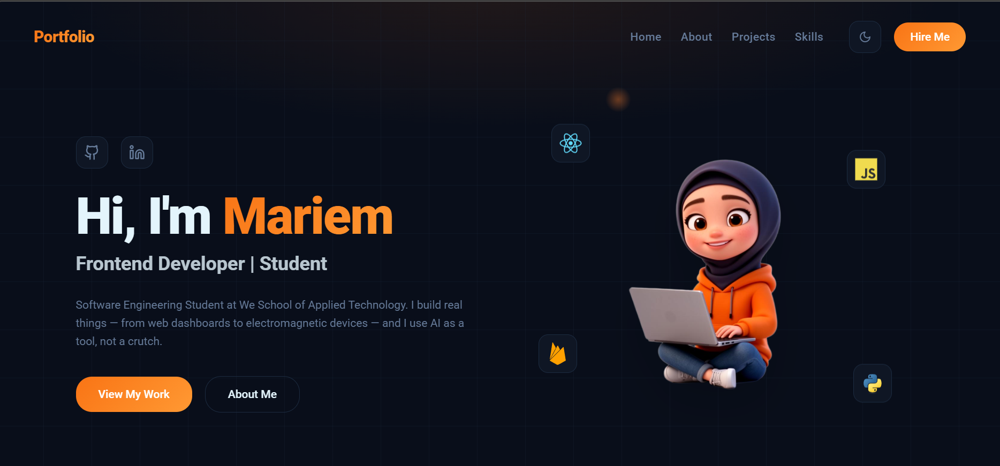

# Mariem Ahmed — Portfolio Website



_A responsive and modern personal portfolio built to showcase my web development and software engineering skills._

**Live Demo:** [Insert Netlify/Vercel/GitHub Pages Link Here]

## 🌟 Overview

This is a multi-page personal portfolio developed as part of the "Build & Host Your Portfolio/Company Website" project. The website is fully responsive, highly interactive, and structurally sound, demonstrating my approach to modern front-end development.

## 🚀 Technologies Used

- **HTML5 & CSS3**
- **TypeScript / JavaScript**
- **React** (v18)
- **Tailwind CSS** (for styling and responsiveness)
- **Vite** (for fast development and bundling)
- **Lucide React** (for icons)
- **Web3Forms** (for contact form email delivery without backend)

## 📌 Key Features

1. **Fully Responsive Design**: Fluid typography, flexbox/grid layouts, and media queries ensure the site works seamlessly on Desktop, Tablet, and Mobile.
2. **Mobile Menu Toggle**: A custom interactive hamburger navigation menu for small screens.
3. **Dark/Light Mode**: User preference theme toggling using standard Tailwind logic.
4. **Interactive Hero & About Animations**: Features an intricate smooth image transition acting as CSS animation.
5. **Form Validation & Delivery**: The Contact page uses Web3Forms for direct-to-email delivery with built-in validation rules.
6. **Back-to-Top Button**: Simple interactive script aiding user navigation.
7. **Single Page Application Routing**: Smooth client-side navigation utilizing `react-router-dom`.

## 📂 Code Structure

- `/src/components` - Holds reusable UI pieces (Hero, About, Projects, Contact, Navbar).
- `/src/pages` - Defines the main page views and connects components (Index, AboutPage, ProjectsPage).
- `/src/hooks` - Custom React hooks (e.g., `useScrollReveal` for scroll animations).
- `App.tsx` - Root app component configuring routing and global providers.

## 🛠️ Setup Instructions

To run this project locally:

1. **Clone the repository:**

   ```bash
   git clone https://github.com/Mariem-Ahmed-11/maruoma-s-portfolio-main.git
   cd maruoma-s-portfolio-main
   ```

2. **Install dependencies:**
   Make sure you have Node.js installed, then run:

   ```bash
   npm install
   ```

3. **Start the development server:**

   ```bash
   npm run dev
   ```

4. **View in browser:**
   Open `http://localhost:5173` to view it in the browser.

## 🧠 Reflection & What I Learned

Through this project, I strengthened my ability to translate a design vision into code using React and Tailwind CSS. Implementing complex CSS animations (like the floating character standing and talking) taught me how to creatively solve problems. Furthermore, integrating the form delivery API (Web3Forms) gave me practical exposure to handling APIs without a dedicated backend server. Overall, this project acts as a testament to my vibe engineering methodology—being highly deliberate about user experience and architecture.
